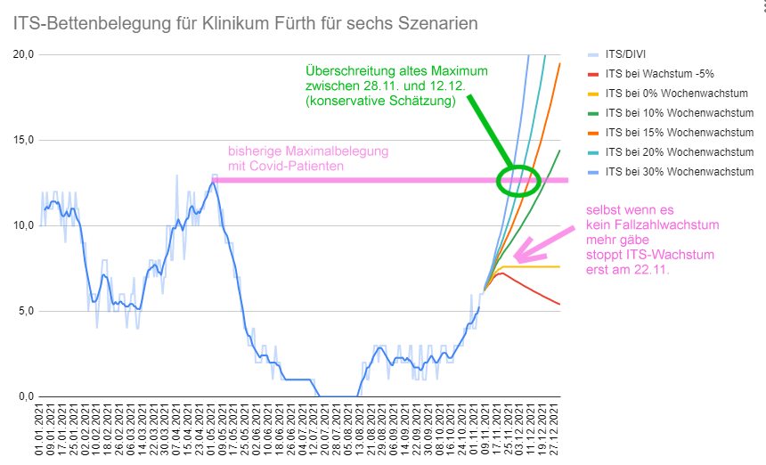
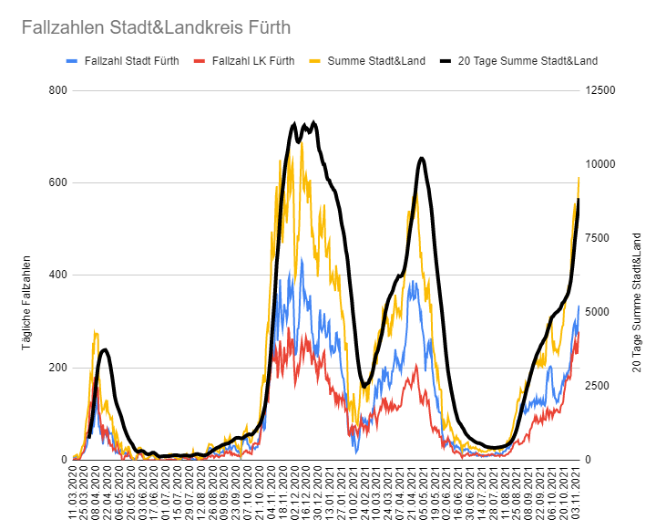
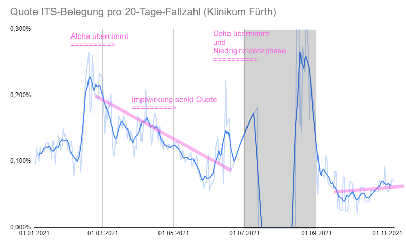
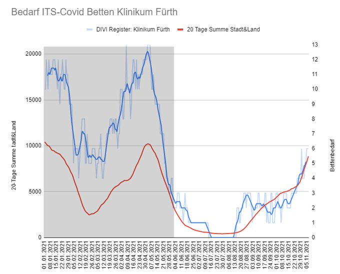
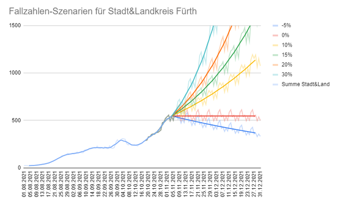

Aufruf Tweet von Dirk
https://twitter.com/dpaessler/status/1458410852818825216

Verweist auf Kochrezept Tweet
https://twitter.com/dpaessler/status/1458397649690927105

# Kochrezept

Ziel:

## Schritt 1: Fallzahlen
Ich hole mir die Fallzahlen von Landkreis und Stadt Fürth (blau/rot) von @risklayer
 und berechne die Summe (gelb). Dann addiere ich jeweils diese Werte der letzten 20 Tage zusammen, sozusagen ein lang-laufender gleitender Mittelwert.

Wichtig ist hier zu sehen, wie die schwarze Linie einen “Overshoot” macht, also über die Spitze der gelben Welle hinausschießt und erst 1-2 Wochen später beginnt zu sinken. Diese Eigenschaft wird gleich noch zu einem Problem werden.

## Schritt 2: Zusammenhang ITS-Belegung und 20-Tage-Fallzahlen
Die ITS-Belegung und die 20-Tage-Fallzahlen haben einen engen Zusammenhang. Diese Quote hat sich zwar im Jahresverlauf mehrfach verändert (u.a. durch Alpha/Delta und die Impfungen).

Aber seit September liegt dieser Wert konstant, und steigt sogar an. Für Fürth ist er zZt ~0,066%. Es ist zu erwarten, dass Quote weiter ansteigt, durch das weitere Nachlassen der Impfwirkungen und steigende Dunkelziffer, aber gehen wir mal davon aus, dass er konstant bleibt.

Der Zusammenhang von 20-Tage-Fallzahlen und ITS-Belegung ist hier auch schon zu sehen: Seit Juni können wir die Fallzahlen verwenden, um die ITS-Belegung abzubilden. Die Kurve aus dem DIVI Intensivregister (blau) passt gut dazu.

## 3. Schritt: Fallzahlen-Szenarios für die nächsten 2 Wochen synthetisch herstellen
Jetzt gehen wir von den aktuellen Fallzahlen aus, und entwickeln verschiedene Szenarios. Wir schreiben die Fallzahlen der letzten Woche mit verschiedenen Wachstums-Raten fort:

Die maximale gezeigte Wachstumsrate von 30% in dieser Gruppe von Szenarien ist übrigens noch eher konservativ, im Moment liegen wir in Deutschland eher über 50% (!).

## 4. Schritt: Fallzahlen in ITS-Bettenbelegung umrechnen
Mit den oben gewonnen Erkenntnissen können wir jetzt für die sechs Szenarien die ITS-Belegungen berechnen und zeichnen:

Wir sehen, dass selbst wenn es zu keinem Fallzahlen-Wachstum mehr kommen würde, oder auch bei leichtem Sinken, erst um den 22.11.2021 (14 Tage später als verwendete Eingangsdaten) die Belastung aufhört zu wachsen (Das ist dieser Overshoot).

Wir sehen auch, dass bei den verwendeten Wachstums-Szenarios zwischen +10% und +30% die alte Maximal-Belegung zwischen dem 28.11. und 12.12. überschritten würde.

Wenn wir also jetzt berücksichtigen, dass das aktuelle Wachstum sogar deutlich über dem höchsten gezeigten Szenario liegt, UND dass die Fallzahlen selbst nach einem sofortigen Lockdown noch 5-7 Tage weiter steigen würden, UND ...
...dass wir selbst bei einem Lockdown ca. 10-14 Tage Verzögerung der Reaktion der ITS-Belegung haben
UND dass es zu einem Overshoot kommt,...
... dann können wir jetzt schon sagen: Das alte Maximum werden wir nahezu sicher überschreiten. Selbst wenn sich diese einfache Herleitung um den Faktor 2 nach oben oder nach unten verrechnen sollte, verändert das die nur Position auf der Zeitachse um maximal 1-2 Wochen.

Wenn wir nicht sofort heftig bremsen, sind wir auf den sehr steilen gezeigten Kurven für die ITS-Betten-Belegung unterwegs, dann ist nur noch die Frage ob es eine Woche früher oder später passiert.

Keine guten Aussichten.

PS: Das ist jetzt alles keine obskure Modellrechnung, sondern einfachste Mathematik der einfachsten Grundrechenarten, die jeder Erwachsene mit etwas guten Willen verstehen können sollte. 

PPS: Den Trick mit dem Zusammenhang der 20-Tage-Fallzahlen und der ITS-Belegung habe ich von [@aloa5](https://twitter.com/aloa5)
. Danke dafür.
